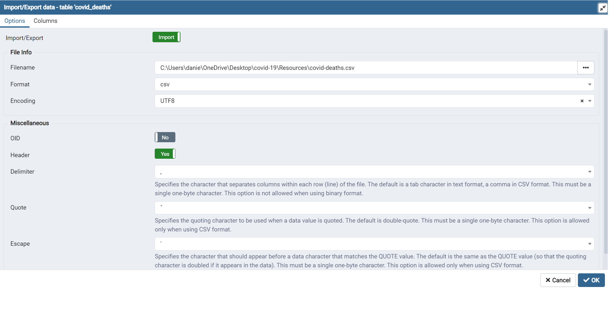
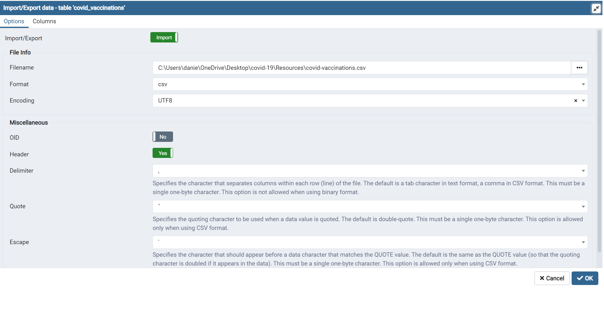

# covid-19

# Documentation

You will be able to go through the files and locate the step number on each section to match this documentation. 

## Step 1 

I downloaded the data from the following link: https://ourworldindata.org/covid-deaths as a CSV file.

## Step 2

I filtered the data in the csv file to get the columns I desiered. I then created two csv files from this:

1. Covid_deaths
2. Covid_vaccinations

Each file contained the raw data.

## Step 3

I created a data base in postgres calles "PortfolioProject" in postgres using the create database function.

## Step 4 

Created the tables inside of the database

1. covid_deaths
2. covid_vaccinations


### Code

```
--STEP 4
-- Creating the covid deaths table in data base

CREATE TABLE public."covid_deaths"
(
    iso_code "char",
    continent character varying,
	location VARCHAR, 
    date date,
    population numeric,
    total_cases numeric,
    new_cases numeric,
    new_cases_smoothed numeric,
    total_deaths numeric,
    new_deaths numeric,
    new_deaths_smoothed numeric,
    total_cases_per_million numeric,
    new_cases_per_million numeric,
    new_cases_smoothed_per_million numeric,
    total_deaths_per_million numeric,
    new_deaths_per_million numeric,
    new_deaths_smoothed_per_million numeric,
    reproduction_rate numeric,
    icu_patients numeric,
    icu_patients_per_million numeric,
    hosp_patients numeric,
    hosp_patients_per_million numeric,
    weekly_icu_admissions numeric,
    weekly_icu_admissions_per_million numeric,
    weekly_hosp_admissions numeric,
    weekly_hosp_admissions_per_million numeric
)
WITH (
    OIDS = FALSE
);

ALTER TABLE public."covid_deaths"
    OWNER to postgres;

--STEP 4
-- Creating table for covid vaccinations
CREATE TABLE public.covid_vaccinations
(
    iso_code VARCHAR,
    continent VARCHAR,
    location VARCHAR,
    date date,
    new_tests numeric,
    total_tests numeric,
    total_tests_per_thousand numeric,
    new_tests_per_thousand numeric,
    new_tests_smoothed numeric,
    new_tests_smoothed_per_thousand numeric,
    positive_rate numeric,
    tests_per_case numeric,
    tests_units VARCHAR,
    total_vaccinations numeric,
    people_vaccinated numeric,
    people_fully_vaccinated numeric,
    new_vaccinations numeric,
    new_vaccinations_smoothed numeric,
    total_vaccinations_per_hundred numeric,
	people_vaccinated_per_hundred numeric,
    people_fully_vaccinated_per_hundred numeric,
    new_vaccinations_smoothed_per_million numeric,
    stringency_index numeric,
    population_density numeric,
    median_age numeric,
    aged_65_older numeric,
    aged_70_older numeric,
    gdp_per_capita numeric,
    extreme_poverty numeric,
    cardiovasc_death_rate numeric,
    diabetes_prevalence numeric,
    female_smokers numeric,
    male_smokers numeric,
    handwashing_facilities numeric,
    hospital_beds_per_thousand numeric,
    life_expectancy numeric,
    human_development_index numeric
)
WITH (
    OIDS = FALSE
);

ALTER TABLE public."covid_vaccinations"
    OWNER to postgres;

```

## Step 5

I loaded the data into the each corresponding table. I had to be very careful when creating the tables as the columns needed to match my csv. I check spelling, type of data, and, total amount of columns.





## Step 6

I verified the data was properly transfered to my postgres data base

### Code

```
--STEP 6
--Checking the data was properly imported into postgres
SELECT * 
FROM covid_deaths;
--STEP 6
--Checking the data was properly imported into postgres
SELECT * 
FROM covid_vaccinations;
```

## Step 7
